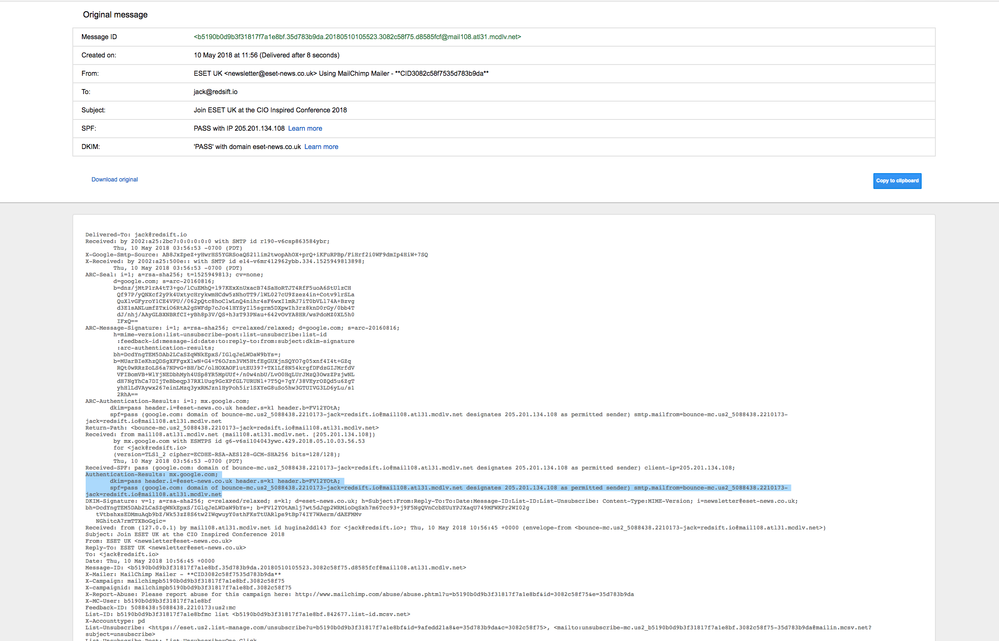

# Red Sift React/DMARC Developer Exercise

Your task is to build your first [sift](https://docs.redsift.com/docs/intro-system-overview).

## Task Details

The sift has to
 - Stream emails from a Gmail inbox into a node
 - Parse the mail headers and extract the DMARC relevant headers and do any further enhancements.
 - Display the results in an interesting manner on the frontend on a per email basis and provide a summary as a whole
 - Complete work in git repository with frequent commits showing us your coding processes.

 Please feel free to ask one of us for help if you are stuck with the SDK or the task.

## Goals

This will be an opportunity to familiarise yourself with the platform and SDK, learn about the protocols DKIM, SPF and DMARC and get a better understanding of our OnDMARC product and showcase your coding talents and eye for presentation. 

All of our products at Red Sift are data driven and focused on visualising and providing insight on the most important parts effectively for clients to understand and use their data.

We are looking for a simple solution with clean, well crafted code with attention to detail. Please have a consistent presentation theme and welcome you copying one from a well known website to see how you work given a set of designs.

Its a short time frame so we stress that you keep it simple but with high quality (We have an example layout for you to use as [inspiration](example-layout.png)) and display the data your choose in a visibly pleasing, straight forward, robust manner but look forward to any additional insights you care to display. Our recommendation is to allow more time for the frontend than the parsing of the headers.

## Setup
You can carry out the task fully in our SDK - [Installation Instructions](https://docs.redsift.com/docs/sdk-installation)

Once installed run `redsift run -nd` to start project locally from root of this repository.

We have already instantied the project on the sdk, combining the `email-sift-web` and `react-sift` templates to save you the time but it's still a good idea to checkout the [controller](frontend/src/scripts/controller.js) and [view](frontend/src/scripts/view.js) files to see the frontend integration and also to view the [email input documentation](https://docs.redsift.com/docs/creating-an-email-input) to get an understanding of the data pipeline.

You are free to choose from any of our supported languages on the backend (note running the SDK with Docker is required for non js nodes) and on top of the React base you can use any frontend framework including D3 and any npm module you see fit for the job. 

**Note** you will need access to a Gmail Inbox to connect to the SDK and have a dataset of emails. Let us know if this proves difficult.

### Useful Links and references

 - https://docs.redsift.com/docs/server-code-jmap
 - https://knowledge.ondmarc.com/learn-about-dmarc
 - https://tools.ietf.org/html/rfc7489 (detailed spec)

Below is a screenshot of typical DMARC authentication results from an raw email. You can see the main header `Authenticatio-Results` you need highlighted, but not there may be more useful headers which include more information for the protocols that you may get round to using.

**Note:** The last person to complete this task had issue with the library @redsift/text-utilities so giving you a warning. You should be able to do without it but highlighting now as not to cause a stumbling block.

### GOOD LUCK

One of our team will be on hand to help with any issues in the set up and provide any clarification but we hope it is easy to develop on the platform and we welcome any feedback you have regarding the experience.
